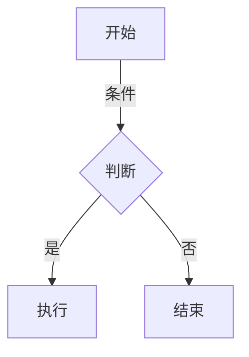
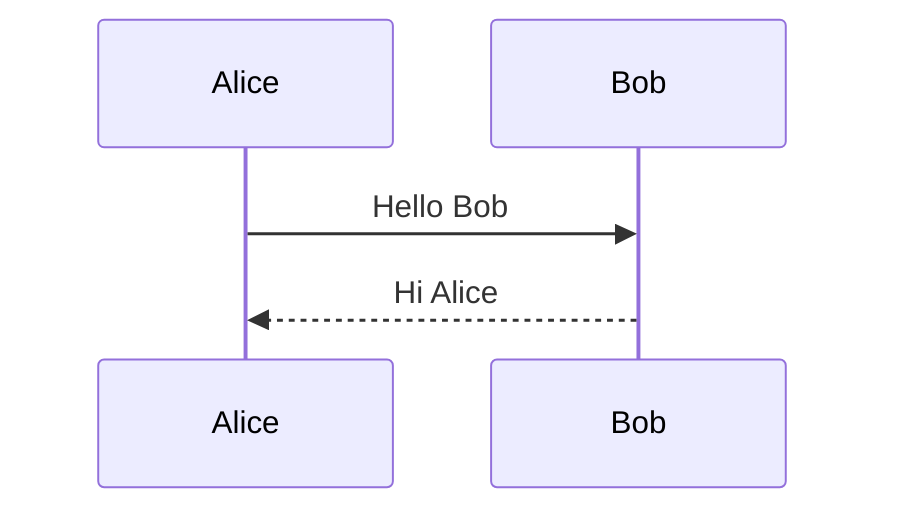
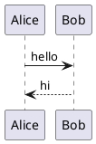

# 图表集成验证

下面三张图分别由 Mermaid 外挂（Node + Edge）和 PlantUML 远程服务渲染成 SVG，
再由 IE11 显示。

## 1. 流程图


```mermaid
graph TD
  A[开始] -->|条件| B{判断}
  B -->|是| C[执行]
  B -->|否| D[结束]
```

## 2. 时序图


```mermaid
sequenceDiagram
  Alice->>Bob: Hello Bob
  Bob-->>Alice: Hi Alice
```

## 3. PlantUML 时序图


```plantuml
@startuml
Alice -> Bob: hello
Bob --> Alice: hi
@enduml
```

## 4. 普通代码块（应保持原样）

```cpp
int main() {
    return 0;
}
```
