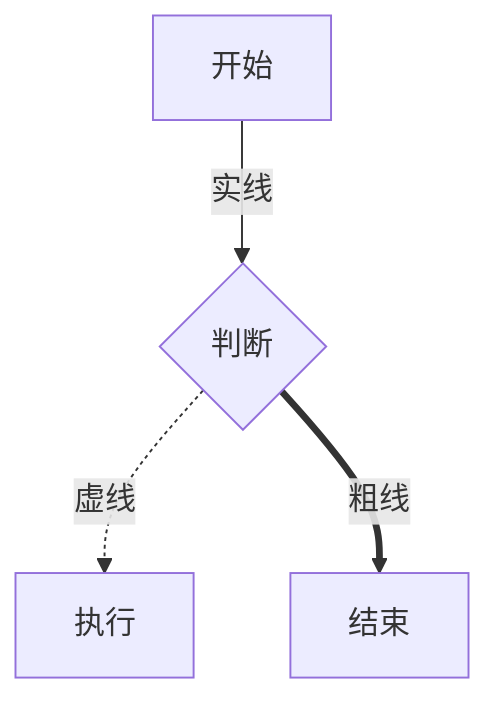
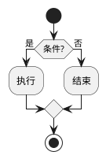

# 浅色 / 深色配色对照

## Mermaid 流程图

```mermaid
graph TD
  A[开始] -->|实线| B{判断}
  B -.->|虚线| C[执行]
  B ==>|粗线| D[结束]
```

## PlantUML 活动图

```plantuml
@startuml
start
if (条件?) then (是)
  :执行;
else (否)
  :结束;
endif
stop
@enduml
```
